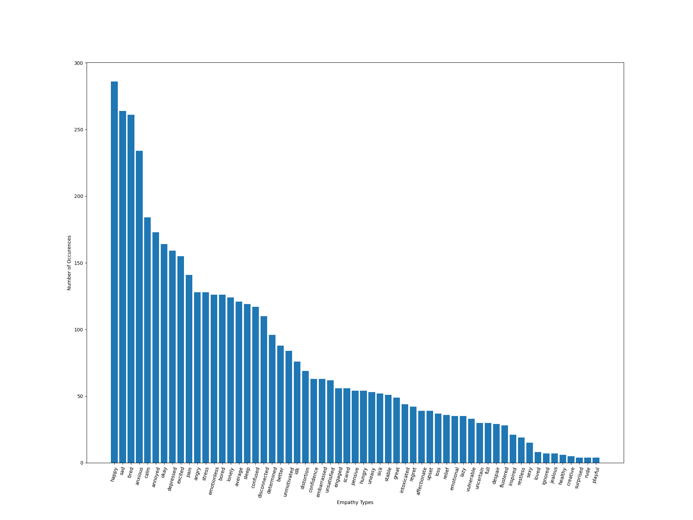
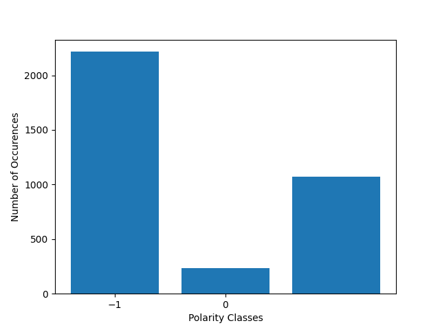
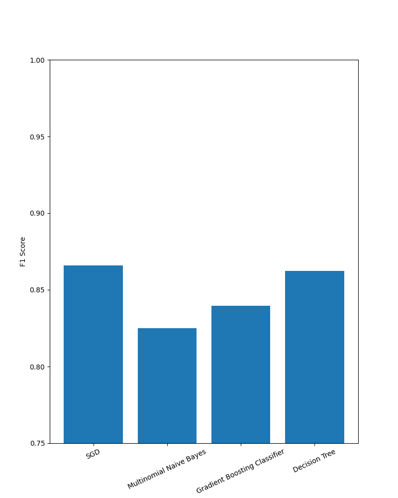

## Chatbot Message Classification

### Usage Intructions
I provided my submission as both a `.zip` folder and a GitHub repo. Please download and unzip the folder or clone the repo, and run the following command in the home directory to install the dependencies:

`pip install -r requirements.txt`

For ease of use, I wrote a shell script called `run_classifier.sh` to run through all the steps chronologically. If you wish to run an individual step, you can copy and paste that step from this script to your command line.

##### Mac OS / Linux
To execute this script on Mac OS or Linux, run `chmod +x run_classifier.sh` once in this project's home directory to set the execute permissions. Then, it can be executed by running `./run_classifier.sh` or `sh run_classifier.sh` in this project's home directory.

##### Windows
If running on a Windows command line, this script can be executed by running `bash run_classifier.sh`.

If you run into any trouble or would like access to the code in a different format, please feel free to email me at meoneill118@gmail.com.

### Approach

#### Pre-processing
Based on my observations of the data, I applied the following pre-processing methods:
1. Removed the `num_seen` and `ignore` columns from the messages dataset, because I did not end up using these.
2. Employed lemmatization to reduce inflected words in the messages to their root word.
3. Removed any characters in messages that were not a plain character or a number.
4. Ran a spell-checker to attempt to fix the spelling of words in the messages.

I also manipulated the data to obtain features that would be useful for visualization and classification. For instance, I added a column to the empathies dataframe that contains the number of times each empathy label appears in the messages dataset. This was useful for graphing the amount of occurences for each empathy label later. 

In order to create a classifier for the polarity, I appended a column to the messages dataframe that contains the polarity (or average polarity if there is more than one empathy label) associated with each message. Then I appended another column to represent whether each message has a positive, neutral, or negative classification, respectively represented by 1, 0, and -1.

Finally, I created a dataset with one hot encodings representing the empathy label of each method, for the purpose of training a multilabel classifier.

#### Data Exploration/Visualization
I created simple graphs using the processed data to display the data distributions of the empathy labels (in order of most common to least common labels) and the polarity classes (-1 to represent a negative polarity, 0 to represent neutral, and 1 to represent positive). These graphs are shown below.

These graphs helped me observe the class imbalance that will be present in classifiers for both polarity and empathy.

#### Models
Due to time constraints, my approach was to employ simple but effective models to start off with as a baseline, and then build upon that baseline. There are certainly other models I would have liked to implement, which I will discuss in the "Future Work" section.

As suggested in the instructions, I wrote classifiers for both polarity and empathy. For polarity, I trained a classifier to determine whether the message was positive, neutral, or negative. I selected 4 models that I thought would perform well on a multiclass sentiment classification task, applied all 4, and graphed the results. These models included a stochastic gradient descent (SGD) classifier, multinomial naive bayes, a gradient boosting classifier, and a decision tree.

For empathy, I decided to employ a traditional classifier, which in this case was a Support Vector Machine (SVM), in a binary relevance framework in which a binary classifier is trained on each class. This is an area I would have certainly liked to improve upon if I had more time, because with 68 potential classes, this created large and sparse data. I handled this sparsity by compressing the data and applying the appropriate results metrics, but this could have been handled with neural networks that can inherently adapt to multilabel classification.

#### Results
The decision tree and the SGD slightly outperform the other models in terms of F1 score. These results are depicted below, and the results data can be found in `/data/results/polarity_classification_results.csv`

The empathy classifier achieved the following results:

| Metrics   | Micro Average Score |
|-----------|----------------------|
| Precision | 0.89                 |
| Recall    | 0.69                 |
| F1        | 0.77                 |

#### Metrics Explanation 
For both the polarity and empathy classifiers, I used the micro-F1 score as the primary performance indicator. The micro-F1 score accounts for class imbalance, which is present in these datasets and depicted in the distribution graphs. It is especially useful for the empathy classifier because it handles cases of multilabel classification accurately due to its nature of accounting for predictions across all labels and instances.

I am also attentive to the metrics of precision and recall, which make up the F1 score. The precision tells me how correct the positive predictions are, and the recall tells me how likely the classifier is to identify a positive prediction as positive. The empathy classifier has a high precision and a low recall, so this tells me that while the classifier's positive predictions are very likely to be correct, it is also likely to miss predicting that a positive label is positive. For the polarity classifier, I generate a whole classificaion report that includes precision, recall, and F1-score for each individual class, along with the averages. This is useful and feasible in this case since there are only 3 classes. For example, I used this report to identify that the "neutral" class performs much more poorly than the other classes.

Focusing on the positive predictions as done with these metrics also avoids some of the problems that arise from using sparse data. For example, given a ground truth label with 66 negative labels and two positive labels, as you may encounter in the empathy encoded dataset, let's say one positive label is correctly predicted, and the rest are predicted to be negative. If you were measuring accuracy, then the whole thing would be considered wrong, giving no consideration to the one correct prediction. On the other hand, if each label is individually considered, as is done with a hamming loss, this can also lead to problems. If the classifier predicted all negative labels across the whole encoded messages dataset, the hamming loss would be excellent because there are only 1-4 positive labels per each 68 labels. The F1 score, precision, and recall remedy these issues and provide a more accurate representation of performance for this dataset.

### Future Work

If I had more time to work on this project, I would:
1. Employ BERT or a RNN for the empathy classification task.
2. Experiment with using cross validation to prevent overfitting.
3. Experiment with resampling techniques (random over/under sampling)to address the class imbalance. 
4. Experiment with taking the num_seen and ignore columns from the original dataset into account. Messages/empathies that have hardly ever been seen could be ignored by setting a flag to True in the ignore column.
5. Optimize the parameters passed to the chosen machine learning model.
6. Make the console output cleaner (Address the warnings in the empathy classifier, and write a try catch exception workaround so that nltk does not print a message that it has already been downloaded).
7. Experiment with different models for the empathy classifier in a similar way as I did for the polarity classifier, in which the results are visualized.
8. Add an optional user input argument for running the polarity classifier to select which individual model to run. For example, if the user ran `python src/models/polarity_classification.py SGD`, then only the SGD model would run.
9. Clean up the visualizations and make them appear nicer.
